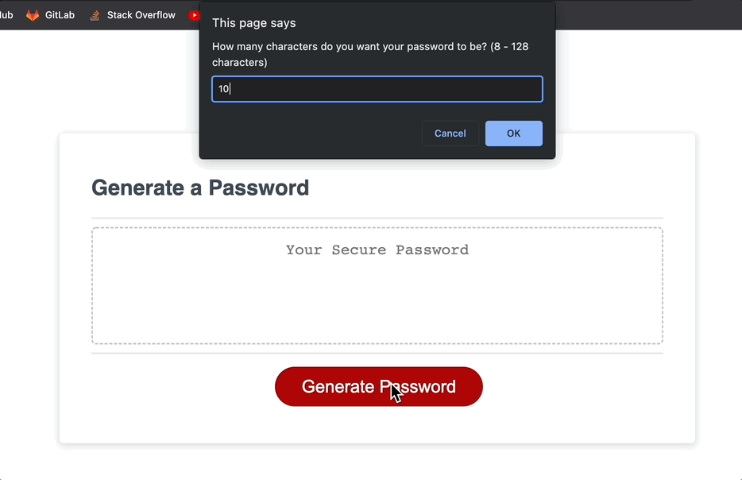

# Password Generator Starter Code

## Description
The purpose of this project is to create a password generator that adheres to the parameters set by the user story and acceptance criteria with the use of JavaScript.

## Goal
### User Story

AS AN employee with access to sensitive data
I WANT to randomly generate a password that meets certain criteria
SO THAT I can create a strong password that provides greater security

### Acceptance Criteria

GIVEN I need a new, secure password
WHEN I click the button to generate a password
THEN I am presented with a series of prompts for password criteria
WHEN prompted for password criteria
THEN I select which criteria to include in the password
WHEN prompted for the length of the password
THEN I choose a length of at least 8 characters and no more than 128 characters
WHEN asked for character types to include in the password
THEN I confirm whether or not to include lowercase, uppercase, numeric, and/or special characters
WHEN I answer each prompt
THEN my input should be validated and at least one character type should be selected
WHEN all prompts are answered
THEN a password is generated that matches the selected criteria
WHEN the password is generated
THEN the password is either displayed in an alert or written to the page

## Installation
In order to view the interactivity of the password generator, you will need to visit the live deployment URL.

## Usage

## Credits
I referenced a YouTube video by Daniel Vega https://www.youtube.com/channel/UCnySYlhvBfcJx2NlRuDv-4g

## License
No license necessary

## Features
The user is able to choose a random password based on the selection of characters based on their preferences. It features dynamically upadted HTML AND CSS powered by JavaScript.